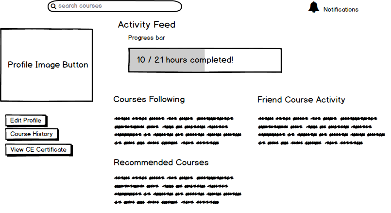

# AdmiralCE
Helping Medical Professionals to navigate the CE

## Getting Started
> New to programming? Check out [Python for Non Programmers](https://wiki.python.org/moin/BeginnersGuide/NonProgrammers)

This project uses [Django](https://www.djangoproject.com/), a [python](https://www.python.org/) web framework. To keep configuration simple, AdmiralCE supports [Docker](https://www.docker.com/).

1. Open terminal (macOS) / Git BASH (Windows)
    2. Navigate to the folder you wish to install the project in
1. clone the repo, `git clone https://github.com/tonjohn/admiralce.git`
    2. You'll need *git* installed -- https://git-scm.com/
1. Run the server via [Docker](https://www.docker.com/) with `bash set_sail.sh`